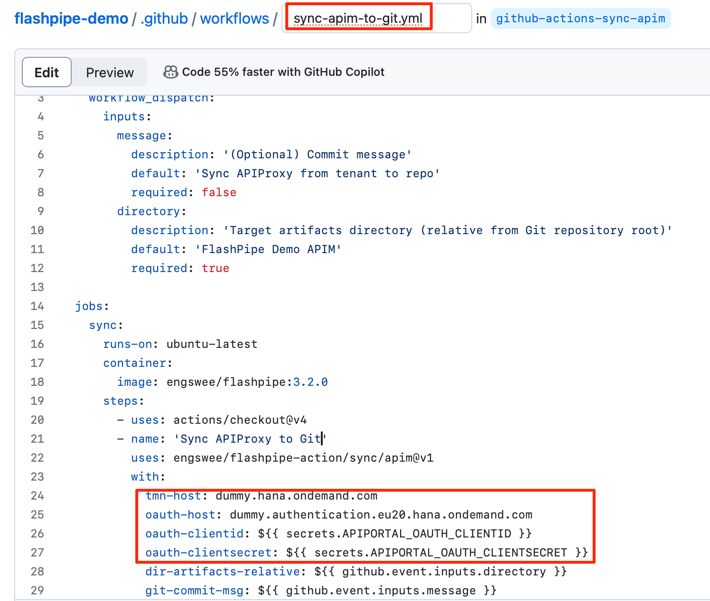
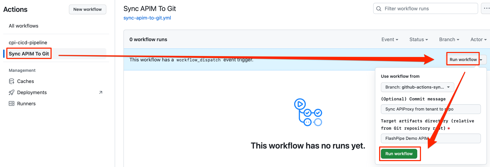
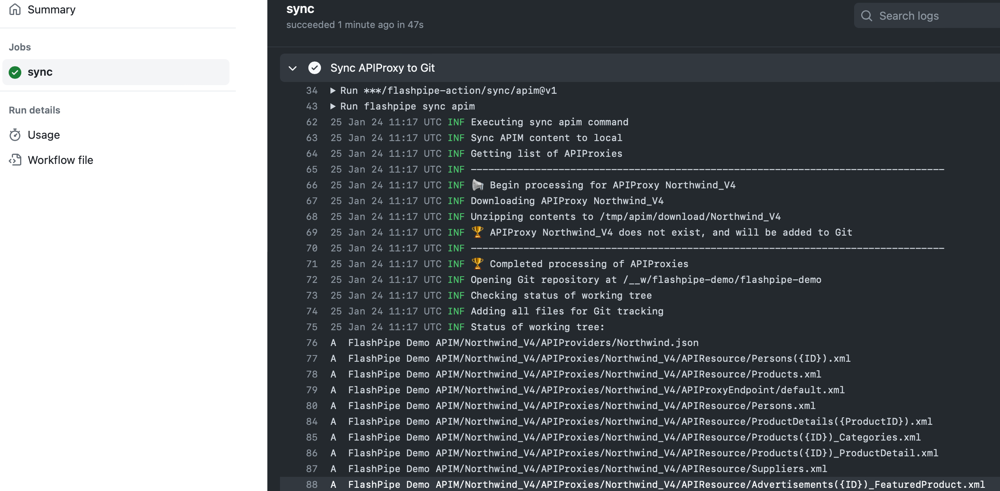
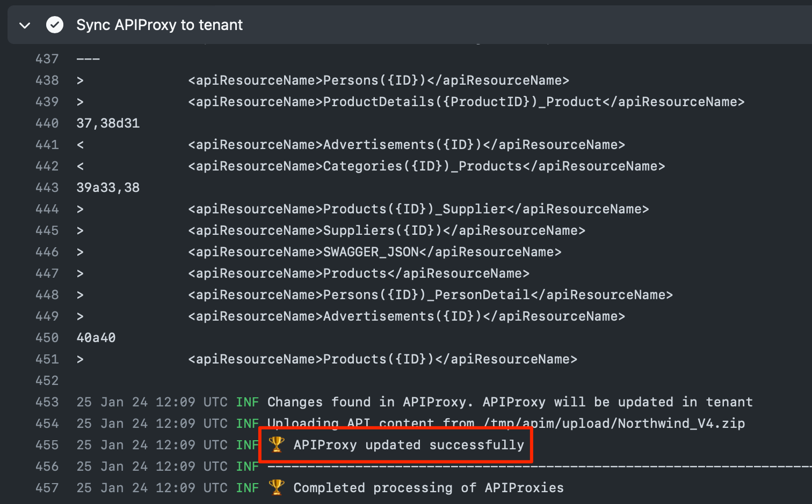

# Sync APIM artifacts between Tenant and GitHub with FlashPipe on GitHub Actions
The page describes the steps to set up _FlashPipe_ on [GitHub Actions](https://github.com/features/actions) to sync API Management artifacts between an Integration Suite tenant and a GitHub repository.

## A. Sync from Tenant to GitHub

### 1. Create GitHub repository
Create (or use) an existing repository on GitHub.

Ensure that the repository includes the following files at the root directory. The links provide samples for each file that can be used.

- [.gitignore](https://github.com/engswee/flashpipe-demo/blob/github-actions-sync/.gitignore) - ensures unwanted files are not included in commits
- [.gitattributes](https://github.com/engswee/flashpipe-demo/blob/github-actions-sync/.gitattributes) - ensures correct line endings for committed files

### 2. Create secrets in GitHub repository
Sensitive information can be stored securely on GitHub using [encrypted secrets](https://docs.github.com/en/actions/reference/encrypted-secrets). These can then be passed to the pipeline steps as environment variables. For _FlashPipe_, we will use these to securely store the details to access the tenant.

In the GitHub repository, go to `Settings` > `Secrets` to create new repository secrets as shown below.

**OAuth Authentication**

Create the following repository secrets. Refer to [OAuth client setup page](oauth_client.md) for details on setting up the OAuth client for usage with _FlashPipe_. Note that API Management credentials differ from Cloud Integration, so ensure that the secret names do not have any conflicts.
1. `APIPORTAL_OAUTH_CLIENTID` - OAuth client ID
2. `APIPORTAL_OAUTH_CLIENTSECRET` - OAuth client secret
   

**Note**: GitHub does not provide functionality to store unencrypted plain text variables, which would be useful for values like the base URLs. Optionally, these can be stored as encrypted secrets instead of being hardcoded in the YAML configuration file.

### 3. Configure workflow permissions
In order for the workflows to be able to make changes to the repository, correct permissions need to be configured.

In the GitHub repository, go to `Settings` > `Actions` > `General`. Scroll down to the `Workflow permissions` section and select `Read and write permissions` and click `Save`.

### 4. Create GitHub Actions workflow
In the GitHub repository, go to `Actions` to create new workflow.

Skip the templates and choose `set up a workflow yourself`.

Provide a suitable name for the workflow file e.g. `sync-apim-to-git.yml` and replace the default content with the code sample below. Replace the tenant and authentication details accordingly - note that the host refers to the management node of the API Portal which differs from the tenant management node of Cloud Integration.

**NOTE** - FlashPipe comes with companion GitHub Action [engswee/flashpipe-action](https://github.com/engswee/flashpipe-action) that simplifies usage in a workflow. The following action is used in the workflow:
- [engswee/flashpipe-action/sync/apim@v1](https://github.com/engswee/flashpipe-action#sync-apim)

Save and commit the new workflow file.

### 5. Trigger workflow execution
This workflow has been configured with `on: workflow_dispatch` event triggering which allows it to be executed manually.

In the GitHub repository, go to `Actions`, select the workflow and click `Run workflow`.

### 6. View execution results

During or upon completion of the workflow run, the logs can be viewed by clicking on the workflow run.

The APIM artifact files have now been downloaded from the tenant and committed to the repository.

## B. Sync from GitHub to Tenant

### 1. Create GitHub Actions workflow
In the GitHub repository, go to `Actions` to create new workflow.

Skip the templates and choose `set up a workflow yourself`.

Provide a suitable name for the workflow file e.g. `sync-apim-to-tenant.yml` and replace the default content with the code sample below. Replace the tenant and authentication details accordingly.

Save and commit the new workflow file.

### 2. Trigger workflow execution
This workflow has been configured with `on: workflow_dispatch` event triggering which allows it to be executed manually.

In the GitHub repository, go to `Actions`, select the workflow and click `Run workflow`.

### 3. View execution results

During or upon completion of the workflow run, the logs can be viewed by clicking on the workflow run.

As seen from the logs, changes in the APIM artifact were synced to the tenant. 